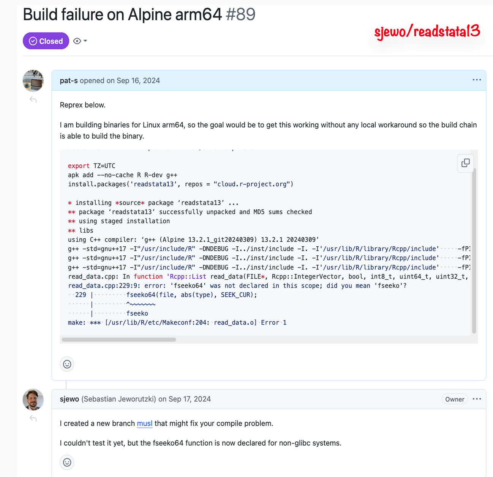
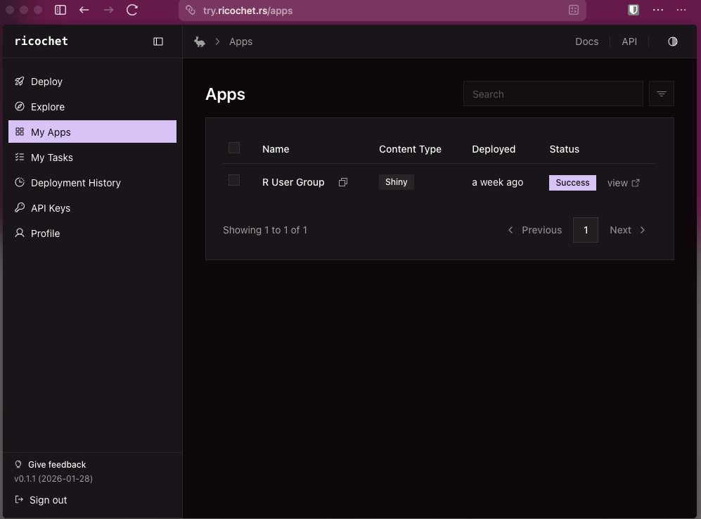

## Part 1: rpkgs.com - Solving the Linux Binary Package Problem

Patrick opened with a critical issue that has plagued the R ecosystem: the absence of a truly distro-agnostic, open-source build process for Linux binary packages. If this sounds like nerdy detail to you, think GitHub Actions, GitLab Actions or give [CrowCI](https://crowci.dev/) a spin! 
While several binary providers exist, each comes with its limitations. According to Patrick the most common issues are:

- **R Universe**: Limited to Ubuntu and historically restricted to amd64 architecture
- **r2u**: Ubuntu-only with what Patrick described as a flawed "island solution" model
- **bspm**: System package manager approach with similar conceptual issues
- **Posit Package Manager**: Proprietary solution with restrictive legal terms explicitly prohibiting use "for the benefit of any third party" or inclusion in "service bureau" offerings

The Alpine Linux situation was particularly problematic to Patrick as a DevOps engineer working on the intersection between DevOps and Data Science. As Patrick emphasized, Alpine has become the de facto standard operating system in CI/CD environments due to its minimal footprint (images are typically 2-5 times smaller than Ubuntu or Red Hat alternatives). Yet none of the existing R ecosystem solutions supported Alpine with its MUSL C library instead of the more common GLIBC.

### rpkgs.com

Enter [rpkgs.com](https://rpkgs.com), a "sovereign, community-powered build chain" that Patrick developed at devXY. His ambitious project offers:

- **Unrestricted usage** across all contexts without legal restrictions
- **Multi-distribution support**: Ubuntu (22.04, 24.04), RHEL/Alma/Rocky (8, 9, 10), and critically, Alpine Linux (3.20-3.23)
- **Multi-architecture**: Both amd64 and arm64 for all supported distributions
- **16 build targets** across 3 major distribution families
- **Massive scale**: 2.5+ TB total size with 1.9 million binary packages built

The technical infrastructure behind rpkgs.com is impressive yet pragmatic. Build servers include Hetzner AX42 machines and Mac Mini M4 hardware, with content delivery handled by Bunny CDN at $10/TB (a fraction of AWS costs). The universal repository at `cran.rpkgs.com` automatically detects your Linux distribution, making setup straightforward.

Patrick mentioned one challenge in particular in his talk: Alpine's MUSL library causes C++ package compilation failures, exotic system dependencies require manual intervention, and some packages simply won't build without significant effort of their authors. Despite R Consortium funding, contributions from community and help from package authors in particular to fix compilaton beyind glibc are inevitable to improve on the build success rate. 

## Part 2: ricochet - Reimagining Data Science Deployment

The second part of Patrick's talk introduced ricochet, a project he co-founded with Josiah Parry (Spatial Data Scientist at ESRI and R Consortium ISC Vice Chair). The motivation? Existing data science deployment platforms are either expensive (Posit Connect at $20k-70k annually) or lack the polish and features that modern data teams expect.

ricochet positions itself as the "cool and affordable" alternative, built from the ground up with a modern architecture and philosophy:

- **Data scientists as developers**: CLI-first deployment with Git-based workflows
- **Language-agnostic**: Support for Shiny, Plumber, ...  and any HTTP service
- **Infrastructure flexibility**: Deploy to bare metal hosts, Docker, or Kubernetes
- **Scalability**: From homelab setups to enterprise environments

### Technical Architecture

Written in Rust (continuing Patrick's theme of leveraging modern, performant tooling), ricochet provides a cross-platform CLI with multiple backend options. Key features include:

- Role-based access controls
- Private and public app deployment
- Scaling controls
- Shared dependency caching (reducing redundant installations)
- Static site deployments

This choice of Rust is noteworthy - it aligns with the broader trend of using Rust for data science infrastructure where performance, reliability, and memory safety are critical.

### Community and Timeline

Currently in beta, ricochet expects its first production release in Q1/Q2 2026. The project is open-source and available at [github.com/ricochet-rs](https://github.com/ricochet-rs). For those curious to try it out, a playable demo instance is available at [try.ricochet.rs](https://try.ricochet.rs).

The proposed pricing model emphasizes accessibility: a homelab tier with unlimited apps and tasks, and an enterprise tier adding unlimited scaling, high availability, whitelabeling, and unlimited users. Notably, Patrick stressed the self-service model without mandatory sales calls - a refreshing departure from enterprise software norms.

### Positioning in the Market

ricochet joins a growing ecosystem of deployment alternatives to Posit Connect:

- **ShinyProxy**: Open-source but with a more complex setup
- **faucet**: Developed by Frans van Dunné, another community-driven alternative
- **Posit Connect**: The established enterprise solution

What distinguishes ricochet is its modern architecture, focus on developer experience, and pricing strategy aimed at making professional deployment accessible to smaller teams and individual developers.

## Key Takeaways

1. **Infrastructure diversity is essential**: Relying on proprietary or single-vendor solutions creates fragility and limits accessibility.

2. **Alpine matters**: As CI/CD and containerization become standard practice, Alpine Linux support is no longer optional - it's essential.

3. **Community sustainability**: Building and maintaining infrastructure is expensive. The R community needs to find sustainable models for supporting critical projects like rpkgs.com.

4. **Modern tooling**: Projects like ricochet show that R tooling can embrace modern architectures (Rust, CLI-first design, Git-native workflows) while remaining accessible.

5. **Affordability and sovereignity drives adoption**: Not every organization or individual can afford five-figure annual licenses. Accessible alternatives democratize professional R deployment.

## Learn more

For those interested to learn more or looking for a way to contribute

- **rpkgs.com**: [Documentation](https://docs.rpkgs.com/) | [devXY Blog Post](https://devxy.io/blog/cran-r-package-binaries-launch/)
- **ricochet**: [GitHub Repository](https://github.com/ricochet-rs) | [Try Demo](https://try.ricochet.rs)
- **Patrick's Slides**: [Full Presentation](https://pat-s.me/talks/2026-01/rpkgs-ricochet#/title-slide)

The talk was a reminder that ecosystem diversity isn't just about having options - it's about creating sustainable, accessible, and community-owned infrastructure that empowers data scientists and R developers regardless of their organization's size or budget.

---

*This review was written by Matthias Bannert of the Zurich R User group. The article is based on Patrick Schratz's presentation at the Zurich R User Group DevOps for Data Science event on January 29, 2025. In addition his presentation slides were processed by Claude Sonnet 4.5 to assist this article.*

## Sources

- [rpkgs.com Documentation](https://docs.rpkgs.com/)
- [devXY Blog: CRAN R Package Binaries Launch](https://devxy.io/blog/cran-r-package-binaries-launch/)
- [Presentation Slides](https://pat-s.me/talks/2026-01/rpkgs-ricochet#/title-slide)
- [Patrick's company devXY](https://devxy.io)
- [bincraft Documentation](https://bincraft.doc.rpkgs.com/)
