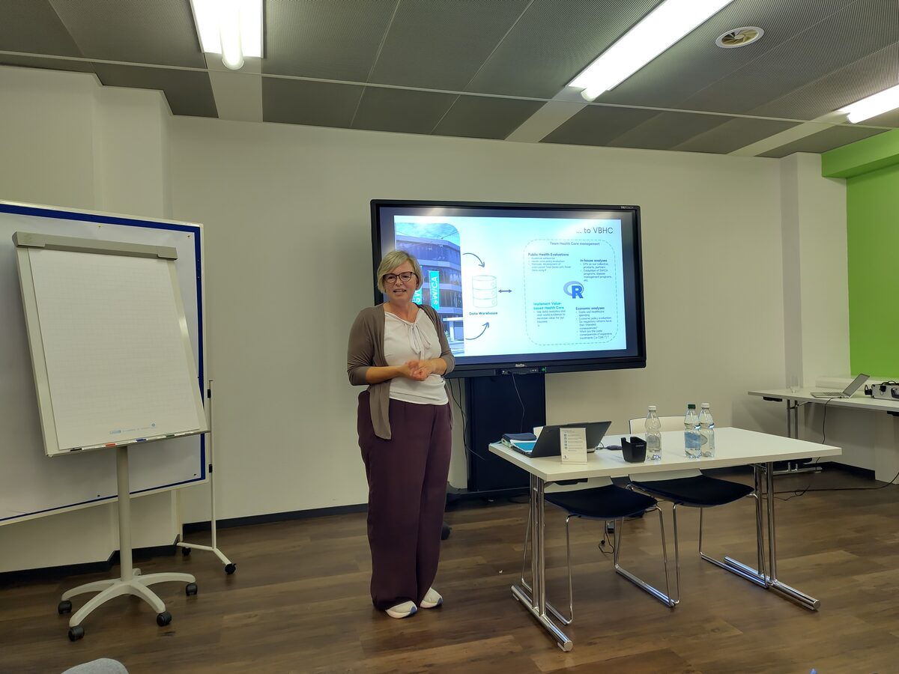

Switzerland has some of the best health outcomes in the world -- and one of the most expensive systems to run. Making better use of health data is central to improving population health and keeping costs in check, and R is playing a growing role on both sides of that equation. For our September meetup, we looked at R and healthcare from three angles: how a major health insurer shifts towards value-based care, how a federal observatory plans and allocates resources across cantons, and how a national foundation uses statistical modelling to understand and predict organ transplants.

A big thank you goes to **SWICA** for hosting us at the **Hotel Banana City in Winterthur**, and to **Aurelien** and **Gerlinde** for leading the organization of the evening.

<!-- PERSONAL NOTE: first impressions -- crowd, venue, mood, weather in Winterthur, any surprises before the talks started. -->

## R for an efficient and qualitative health care system (Eva Blozik, SWICA)

Eva Blozik, Head of Healthcare Management at SWICA, opened the evening with the insurer's perspective on how data analysis drives value-based care. Her team combines public health evaluations, in-house analyses, and economic analyses on top of a shared data warehouse -- with R sitting at the center of the analytical stack.

<!-- PERSONAL NOTE: what stood out about SWICA's setup? Any specific methods (interrupted time series, panel data), any concrete examples from her team's work, the room's reaction, questions from the audience. -->

## R for health policy planning -- from Copy-Paste to Pipelines (Jonathan Zufferey & Reto Jörg, Obsan)

Jonathan Zufferey and Reto Jörg from the **Swiss Health Observatory (Obsan)** walked us through two projects that show how R is reshaping health policy analytics in Switzerland.

The first was Obsan's **cantonal health reports** based on the Swiss Health Survey. What used to be a manual chain of SAS exports, Excel copy-paste and Word assembly -- repeated for every canton -- is now a fully integrated R workflow that produces both a web output and a PDF report from the same source.

- swiss health survey (SHS), health reports based on 50 key vars
- reports: tables, viz: bar and spatial maps -> 150 p. bi-lang
- 8-12 reports (cantonal level)
- past: SAS, Excel, many sheets -> templates
- new architect: JS, R, Report Content Dev
- 

Q: How much of a role does synthetic data play in this? agents handle dev -> saving time
=> restrictions using Ai
Q: Is there an API for you data? -> useful to the enduser, yes and no.
=> encourage to provide APIs by default.

The second project was the **Primary Care Monitoring System**, a Floating Catchment Area (FCA) model of regional disparities in access to primary care. Provider capacity comes from health insurance claims, demand is modelled from population and commuter flows, and accessibility is derived from road-network travel times -- with DuckDB doing the heavy lifting.

- challenges: tariff inputs 120 GB, 40K parquet files
- kindergarden hardware setup
- DuckDB as a game changer

<!-- PERSONAL NOTE: pipeline details worth calling out, the before/after contrast that landed with the audience, any tooling choices (Quarto? targets? DuckDB tricks?) and questions from the crowd. 

-->

## R for predicting kidney transplant success (Simon Schwab, Swisstransplant)

Simon Schwab closed the technical part of the evening with the **KIDMO project** (Kidney Prediction Model) at Swisstransplant. In 2025, 292 deceased-donor kidney transplants were performed in Switzerland, while more than 880 patients remained on the national waiting list at year-end. Even with excellent overall outcomes, graft loss remains a major concern -- and a good target for statistical prediction.

Simon walked us through the model development and validation pipeline, and showed how a clinical prediction model can be turned into a practical tool: an R package plus an online risk calculator built with Shiny, Quarto and Posit Connect Cloud.

<!-- PERSONAL NOTE: modelling approach, validation strategy, the live demo of the calculator, and how the clinical audience might use it. -->

## Apéro & Networking

After the talks we moved to the apéro -- the part of every ZRUG evening where the actual bandwidth between attendees really opens up.

<!-- PERSONAL NOTE: conversations at the apéro, who you met, any recurring themes (data access, real-world evidence, hiring, tooling), and anything you'd like to follow up on in a future meetup. -->

## Thanks

Thanks again to **SWICA** for hosting and sponsoring the evening, to **Eva Blozik**, **Jonathan Zufferey**, **Reto Jörg** and **Simon Schwab** for their talks, and to everyone who came out to Winterthur. See you at the next one!

<!-- Optional: add links to slides once available, and to the speakers' projects (SWICA, Obsan, Swisstransplant, KIDMO). -->
